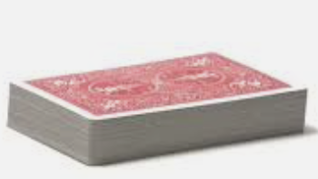
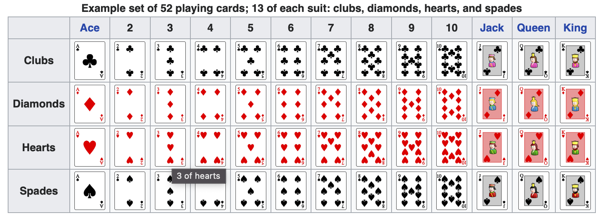
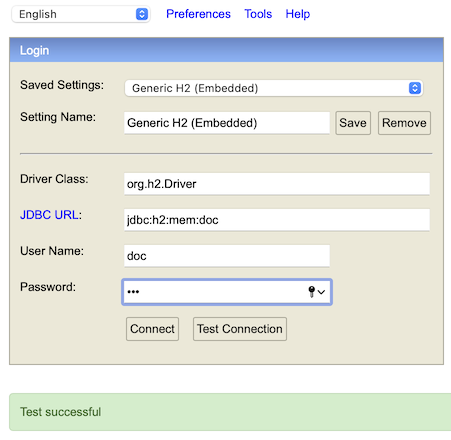

# Problem
We'd like to model __Deck of Cards__ in our app and prepare __shuffled set of cards__ for a play.
So:
* cards are shuffled (random order)
* cards are ordered _1, 2, 3_
* we can get a card by its position (we get random one)
* all 52 cards (no more, no less) are in a pile after shuffling

## Standard deck of cards
_The standard 52-card deck of French-suited playing cards is the most common pack..._ [Wiki](https://en.wikipedia.org/wiki/Standard_52-card_deck)

| Ranks | Suits        |
|-------|--------------|
| 2     | Clubs |
| 3     | Diamonds |
| 4     | Hearts |
| 5     | Spades |
| 6     |  |
| 7     |  |
| 8     |  |
| 9     |  |
| 10    |  |
| Jack  |  |
| Queen |  |
| King  |  |
| Ace   |  |
## Link for the game
[Shuffle the cards](http://localhost:8080/shuffle)

[Get a cards](http://localhost:8080/card/42)
## Some hints
[H2 Console](http://localhost:8080/h2-console)

